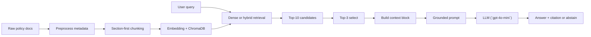

# Architecture - RAG Pipeline (Day 08 Lab)

> Deliverable của Documentation Owner.
> Tài liệu này mô tả kiến trúc theo snapshot repo hiện tại ngày 2026-04-13 trên nhánh đã merge Sprint 1 và Sprint 2, đồng thời đã có implementation cho các lựa chọn Sprint 3.

## 1. Tổng quan kiến trúc

```
[Raw Docs]
    ↓
[index.py: Preprocess → Chunk → Embed → Store]
    ↓
[ChromaDB Vector Store]
    ↓
[rag_answer.py: Query → Retrieve → (Rerank) → Generate]
    ↓
[Grounded Answer + Citation]
```

Nhóm đang xây một internal assistant cho khối CS, IT Helpdesk và IT Security để trả lời câu hỏi về policy, SLA, access control và FAQ nội bộ. Pipeline được thiết kế theo hướng grounded RAG: tài liệu được chia chunk có metadata, retrieve theo ngữ cảnh, rồi LLM chỉ được phép trả lời dựa trên context đã lấy ra và phải ưu tiên citation hoặc abstain khi thiếu bằng chứng.

---

## 2. Indexing Pipeline (Sprint 1)

### Tài liệu được index
| File | Nguồn | Department | Số chunk |
|------|-------|-----------|---------|
| `policy_refund_v4.txt` | `policy/refund-v4.pdf` | CS | 6 |
| `sla_p1_2026.txt` | `support/sla-p1-2026.pdf` | IT | 5 |
| `access_control_sop.txt` | `it/access-control-sop.md` | IT Security | 7 |
| `it_helpdesk_faq.txt` | `support/helpdesk-faq.md` | IT | 6 |
| `hr_leave_policy.txt` | `hr/leave-policy-2026.pdf` | HR | 5 |

Tổng cộng corpus hiện có 29 chunks sau khi chạy `preprocess_document()` và `chunk_document()` trên 5 tài liệu trong `data/docs/`.

### Quyết định chunking
| Tham số | Giá trị | Lý do |
|---------|---------|-------|
| Chunk size | 400 tokens (xấp xỉ 1600 ký tự) | Nằm trong khoảng gợi ý của lab, đủ giữ một policy section hoàn chỉnh nhưng chưa quá dài khi đưa vào prompt |
| Overlap | 80 tokens (xấp xỉ 320 ký tự) | Giữ ngữ cảnh khi một section buộc phải tách nhỏ, giảm rủi ro mất điều kiện hoặc ngoại lệ ở ranh giới chunk |
| Chunking strategy | Heading-based trước, char-based fallback sau | Tài liệu nguồn đã có heading rõ như `=== Điều ... ===`, `=== Phần ... ===`, `=== Section ... ===`, nên ưu tiên giữ nguyên cấu trúc nghiệp vụ trước khi fallback về cắt theo độ dài |
| Metadata fields | `source`, `section`, `department`, `effective_date`, `access` | Phục vụ citation, debug retrieval, freshness reasoning và filtering theo phòng ban/quyền truy cập |

### Quan sát từ corpus hiện tại
- Với 5 tài liệu mẫu hiện có, mỗi section đều vừa trong một chunk; vì vậy số chunk hiện tại bằng đúng số heading-level section của từng file.
- Chiến lược heading-first đang hợp với corpus vì policy và SOP đều có cấu trúc điều khoản/section rõ ràng.
- Fallback char-based trong `_split_by_size()` là lớp an toàn cho các tài liệu dài hơn về sau, nhưng trên snapshot hiện tại chưa phải dùng nhiều.

### Embedding model
- **Embedding provider đang được implement**: OpenAI
- **Model embedding đang dùng**: `text-embedding-3-small`
- **Vector store**: ChromaDB (`PersistentClient`)
- **Similarity metric**: Cosine

### Chi tiết lưu trữ hiện tại
- Collection name: `rag_lab`
- Chroma path: `chroma_db/`
- Cách rebuild: `build_index()` xóa collection cũ rồi upsert lại toàn bộ chunks để tránh dữ liệu cũ lẫn với index mới

Ghi chú: `get_embedding()` đã được implement bằng OpenAI trong `index.py`, nên phần indexing hiện yêu cầu `OPENAI_API_KEY` trước khi build index.

---

## 3. Retrieval Pipeline (Sprint 2 + 3)

### Baseline (Sprint 2)
| Tham số | Giá trị |
|---------|---------|
| Strategy | Dense (embedding similarity) |
| Top-k search | 10 |
| Top-k select | 3 |
| Rerank | Không |

Baseline này khớp với cấu hình hiện có trong `rag_answer.py` và `eval.py`: search rộng 10 chunks, sau đó chọn 3 chunks để build context block. Mục tiêu của baseline là đơn giản, dễ debug, và đủ rõ để làm mốc A/B cho Sprint 3.

### Variant (Sprint 3)
| Tham số | Giá trị | Thay đổi so với baseline |
|---------|---------|------------------------|
| Strategy | Hybrid (`dense + sparse/BM25` với RRF) | Đổi retrieval mode từ dense sang hybrid |
| Top-k search | 10 | Giữ nguyên để không làm nhiễu A/B |
| Top-k select | 3 | Giữ nguyên để so sánh công bằng |
| Rerank | Tùy chọn, đã có implementation | Có thể bật thêm nếu hybrid vẫn còn noise |
| Query transform | Đã có helper implementation, chưa được wire vào `rag_answer()` mặc định | Dành cho vòng tune tiếp theo nếu cần tăng recall |

**Lý do chọn variant này:**
Corpus có cả ngôn ngữ tự nhiên lẫn exact terms như `P1`, `Flash Sale`, `VPN`, `Admin Access`, `Approval Matrix`, `ERR-403-AUTH`. Dense retrieval phù hợp với ngữ nghĩa tổng quát, nhưng hybrid phù hợp hơn cho các query chứa alias, tên cũ, mã lỗi hoặc keyword chính xác. Trong test set, `q07` là tín hiệu rõ nhất vì query dùng tên cũ "Approval Matrix" trong khi tài liệu hiện tại đã đổi tên thành "Access Control SOP".

### Trạng thái implementation Sprint 3
- `retrieve_sparse()` đã được implement bằng BM25 trên toàn bộ chunks lấy từ ChromaDB.
- `retrieve_hybrid()` đã được implement bằng Reciprocal Rank Fusion với trọng số mặc định `dense_weight=0.6`, `sparse_weight=0.4`.
- `rerank()` đã có implementation bằng LLM, chấm từng cặp `(query, chunk)` theo thang 0-10 rồi chọn lại top-k.
- `transform_query()` đã có implementation cho `expansion`, `decomposition`, và `hyde`, nhưng hiện chưa được gọi mặc định trong `rag_answer()`.

**Lưu ý về A/B rule:**
Code hiện đã hỗ trợ cả hybrid và rerank, và `VARIANT_CONFIG` trong `eval.py` đang để `retrieval_mode="hybrid"` cùng `use_rerank=True`. Tuy nhiên, nếu muốn giải thích delta thật chặt theo A/B rule, nhóm nên chạy thêm ít nhất một vòng `hybrid-only` trước khi kết luận về tác động của rerank.

---

## 4. Generation (Sprint 2)

### Grounded Prompt Template
```text
Answer only from the retrieved context below.
If the context is insufficient to answer the question, say you do not know and do not make up information.
Cite the source field (in brackets like [1]) when possible.
Keep your answer short, clear, and factual.
Respond in the same language as the question.

Question: {query}

Context:
[1] {source} | {section} | score={score}
{chunk_text}

[2] ...

Answer:
```

### LLM Configuration
| Tham số | Giá trị |
|---------|---------|
| Model | `gpt-4o-mini` |
| Temperature | 0 |
| Max tokens | 512 |

`rag_answer.py` đang đặt `LLM_MODEL` mặc định là `gpt-4o-mini`, và `.env.example` cũng dùng cùng giá trị này. Temperature được giữ ở 0 để output ổn định hơn khi evaluation. Ngoài bước generate answer, cùng model này hiện còn được dùng trong `rerank()` và `transform_query()`.

---

## 5. Failure Mode Checklist

> Dùng khi debug theo thứ tự index → retrieval → generation.

| Failure Mode | Triệu chứng | Cách kiểm tra |
|-------------|-------------|---------------|
| Metadata sai hoặc thiếu | Context đúng nội dung nhưng citation sai nguồn hoặc thiếu freshness signal | Chạy preview trong `index.py`, kiểm tra `source`, `section`, `effective_date`, `department`, `access` |
| Chunking cắt sai ranh giới | Một policy rule bị tách mất ngoại lệ hoặc mất câu điều kiện | Dùng `chunk_document()`/preview của `index.py` để đọc 2-3 chunk đầu của từng tài liệu |
| Dense retrieval hụt alias/keyword | Query kiểu `Approval Matrix`, `ERR-403-AUTH`, `P1` không retrieve đúng nguồn | So sánh dense với hybrid bằng `compare_retrieval_strategies()` khi retrieval đã hoàn thiện |
| Retriever không mang đủ evidence | Answer đúng một phần nhưng thiếu điều kiện ngoại lệ | Kiểm tra `score_context_recall()` trong `eval.py` và đối chiếu `expected_sources` |
| Prompt grounding yếu | Model trả lời nghe hợp lý nhưng thêm chi tiết không có trong docs | Kiểm tra `score_faithfulness()` và đọc lại context block/prompt |
| Abstain chưa đủ chặt | Câu không có trong docs vẫn bị model đoán đại | Test trực tiếp với `ERR-403-AUTH` và các query thiếu context đặc biệt |
| Eval chưa chốt được delta | Đã có baseline/variant code nhưng chưa có scorecard thật | Hoàn thiện các hàm scoring trong `eval.py` và sinh `results/scorecard_*.md` |

---

## 6. Diagram


